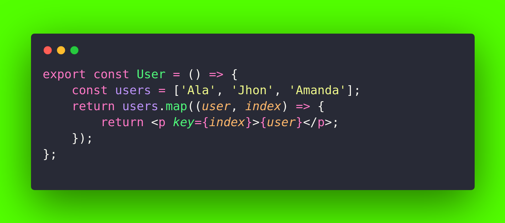

  <h1>React Spot The Mistake</h1>

---

I post <i><Spot the mistake in #react code></Spot></i> on my [Linkedin](https://www.linkedin.com/in/alaedddine/), which I'll also post here!

From basic to advanced: test how well you know React, refresh your knowledge a bit or prepare for your coding interview! :muscle: :rocket: I update this repo regularly with new questions. I added the best answer and the linkedin profile of the person who answered it in the **collapsed sections** below the questions, simply click on them to expand it. It's just for fun, good luck! :heart:

### [POST 1](https://www.linkedin.com/posts/alaedddine_react-activity-7077249277659377665-dv7c?utm_source=share&utm_medium=member_desktop)

 

<b>Best Answer</b>

##### By : [Amirhosein Zare](https://www.linkedin.com/in/amirhosein-zare-80a904201)

Using `index` as `key` when mapping and returning elements in React it will cause errors in the future when you wish to update or delete one of them.

React uses`index` in mapping so it can specify elements from each other. If you use `index` as keys, whenever you delete one of the elements, the indexes will be used wrongly for other elements, so it will cause unpredictable errors and bugs, especially whenever you are using third parties.

If your list wont be updated or modified, and it will be statics and constant so there is no problem using indexes as keys but it's always a best practice to use unique keys.

If you dont have already some kind of databse ids or any uniqe identifiers you can use libraries that generate uniqe ids such as uuid and be sure the will be no errors or bugs.

And there is no error for returning an array of elements in a React component
You are allowed to return an array (an array of any type) as output in your React component.

